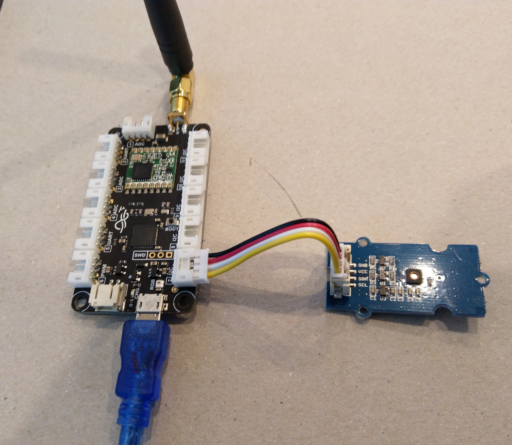

# FieldGateway.LoRa.NexusClient

Sample plug n play [Nexus](https://store.ingenuitymicro.com/nexus) client for my [LoRa](https://lora-alliance.org/) field gateway projects.

Beta version with magic numbers for GPIO pins and RGB LED code will sort these out later as I build out Visual Studio support and port additional drivers.

The [RFM9XLoRa-NetMF](https://github.com/KiwiBryn/RFM9XLoRa-NetMF) and [Silicon Labs Si7005](https://www.silabs.com/products/sensors/humidity/si7005) temperature and humidity sensor drivers are my own work.

Designed and Assembled in New Zealand by [Ingenuity Micro](https://ingenuitymicro.com/)

